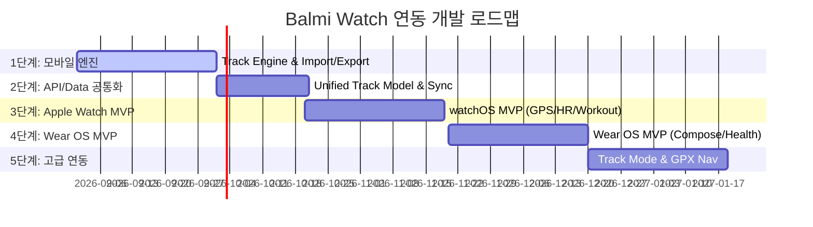

# Balmi Watch 연동 및 독립형 워치 아키텍처 아키텍처 명세서 (v1.0)

> **상태**: Draft / Strategic Technical Roadmap  
> **일자**: 2026-08-28  
> **목적**: Balmi 모바일 앱과 독립형 Apple Watch (watchOS) 및 Galaxy Watch (Wear OS) 연동 아키텍처 및 단계별 로드맵 정의

---

## 1. 개요 및 제품 방향 (Standalone Companion)

Balmi는 **"단 한 걸음도 잃어버리지 않는 무손실 이동 기록"**을 목표로 합니다.
워치 연동은 단순한 모바일 리모컨이 아닌, **독립 실행 가능한 스마트 워치 Companion 앱 (Standalone Companion)** 구조를 지향합니다.

```
┌─────────────────┐       ┌─────────────────┐       ┌─────────────────┐
│   Balmi Watch   │ ◄───► │  Balmi Backend  │ ◄───► │   Balmi Mobile  │
│(watchOS/Wear OS)│       │ (Unified Sync)  │       │ (iOS / Android) │
└─────────────────┘       └─────────────────┘       └─────────────────┘
```

### 왜 독립형(Standalone)인가?
1. **단독 러닝/운동 보장**: 사용자가 스마트폰을 집에 두고 시계만 착용하고 뛰는 상황 완벽 지원.
2. **독립된 오프라인 기록 저장**: 워치 내부 SQLite/Room DB에 1초 단위 GPS/센서 포인트를 저장한 후, 백엔드 또는 휴대폰 재연동 시 무손실 동기화.
3. **VASA 심혈관 센서 데이터 통합**: 심박수(Heart Rate), 케이던스(Cadence), 운동 부하 데이터를 수집하여 헬스케어 가치 극대화.

---

## 2. 통합 데이터 모델 및 이종 기기 호환성

모바일, 워치, GPX 파일 모두 **동일한 스키마 구조**를 공유하며 `sourceDevice` 메타데이터로 출처를 명확히 구분합니다.

### 2.1 Unified Track Schema

```json
{
  "sessionId": "BALMI-20260828-091204",
  "userId": "usr_991823",
  "activityType": "RUNNING",
  "sourceDevice": "APPLE_WATCH",
  "deviceInfo": {
    "platform": "watchOS 10.4",
    "model": "Apple Watch Series 9",
    "hasStandaloneGps": true,
    "hasHeartRateSensor": true
  },
  "stats": {
    "totalDistanceM": 10030.5,
    "totalDurationSec": 2840,
    "avgPaceMinPerKm": "4'43\"",
    "avgHeartRateBpm": 152,
    "maxHeartRateBpm": 174,
    "avgCadenceSpm": 168
  },
  "trackPoints": [
    {
      "timestamp": "2026-08-28T09:12:05Z",
      "lat": 37.5665,
      "lng": 126.9780,
      "altM": 42.1,
      "speedKmh": 11.2,
      "hAccM": 4.2,
      "heartRateBpm": 142,
      "cadenceSpm": 164
    }
  ],
  "laps": [
    {
      "lapNo": 1,
      "distanceM": 400,
      "durationSec": 102,
      "avgPace": "4'15\""
    }
  ],
  "synced": true
}
```

### 2.2 Source Device Enum
* `PHONE_ANDROID`: Android 모바일 측정
* `PHONE_IOS`: iOS 모바일 측정
* `APPLE_WATCH`: Apple Watch 독립/연동 측정
* `WEAR_OS`: Wear OS (Galaxy Watch 등) 독립/연동 측정
* `IMPORTED_GPX`: GPX/KML 파일 임포트 경로

---

## 3. 플랫폼별 스택 및 빌드 구조

### 3.1 Apple Watch (watchOS)
* **개발 환경**: Xcode + Swift + SwiftUI + watchOS SDK
* **핵심 프레임워크**:
  * `HKWorkoutSession` & `HKLiveWorkoutBuilder`: 백그라운드 운동 지속 및 심박수/칼로리 측정
  * `CLLocationManager`: 독립 GPS 위치 추적
  * `WatchConnectivity`: iPhone 앱과의 숏레인지 퀵 동기화 (WCSession)
* **배포**: iOS Xcode 프로젝트 내 `watchOS App Target` 추가 및 App Store Connect 멀티플랫폼 배포

### 3.2 Galaxy Watch / Wear OS
* **개발 환경**: Android Studio + Kotlin + Jetpack Compose for Wear OS
* **핵심 프레임워크**:
  * `Health Services for Wear OS`: 고효율 운동 센서(심박수, 케이던스) 바인딩
  * `Foreground Service`: 오프라인 무손실 포인트 수집
* **Manifest 선언**:
  ```xml
  <meta-data
      android:name="com.google.android.wearable.standalone"
      android:value="true" />
  ```
* **배포**: Google Play Console Wear OS App Bundle 등록

---

## 4. 등산 / 성묘 GPX Waypoint 네비게이션 UX

모바일에서 가져온 GPX 궤적(`할아버지_산소가는길.gpx`) 및 Waypoint(갈림길, 깃발)를 워치 앱으로 전송하여 스마트폰을 주머니에서 꺼내지 않고 손목에서 방향을 안내받습니다.

```
┌─────────────────────────────────────────┐
│           Balmi Watch Nav               │
│                                         │
│          다음 깃발 갈림길                 │
│               82m ◄                     │
│              [ ⇦ 왼쪽 ]                 │
│                                         │
│    산소까지 남은 거리: 430m (고도 +45m)  │
└─────────────────────────────────────────┘
```

---

## 5. 단계별 개발 로드맵



1. **1단계 (현재 완료 및 확장)**: 모바일 Track Engine (1초 SQLite 저장, 60포인트 청크 백엔드 Sync, GPX Import/Export) 완성.
2. **2단계**: 이종 기기 지원을 위한 백엔드 API & JSON Unified Track 데이터 모델 규격화.
3. **3단계**: Apple Watch MVP (watchOS Companion Target: 운동 시작/일시정지/종료, GPS, 심박수, Pace, Server Sync).
4. **4단계**: Wear OS MVP (Kotlin/Compose Wear OS: Standalone 지원).
5. **5단계**: 자동 트랙 랩 감지, GPX Waypoint 손목 네비게이션, VASA 심혈관 심박 분석 연동.
